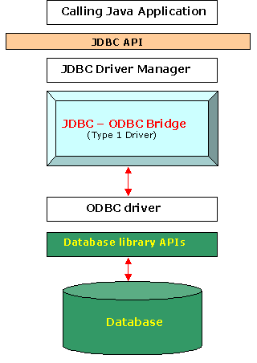
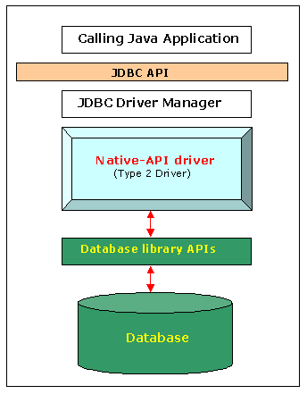
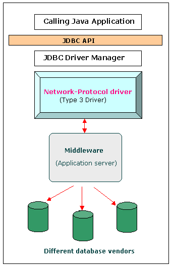

# JDBC

- [JDBC driver](#jdbc-driver)
  - [Type 1 driver - JDBC-ODBC bridge](#type-1-driver---jdbc-odbc-bridge)
  - [Type 2 driver - Native-API driver](#type-2-driver---native-api-driver)
  - [Type 3 driver - Network-Protocol driver (middleware driver)](#type-3-driver---network-protocol-driver-middleware-driver)
  - [Type 4 driver - Database-Protocol driver (Pure Java driver)](#type-4-driver---database-protocol-driver-pure-java-driver)

## JDBC driver

A **JDBC driver** is a software component enabling a Java application to interact with a database.

To connect with individual databases, JDBC (the Java Database Connectivity API) requires drivers for each database. The JDBC driver gives out the connection to the database and implements the protocol for transferring the query and result between client and database.

### Type 1 driver - JDBC-ODBC bridge

#### Advantages

- Almost any database for which an ODBC driver is installed can be accessed, and data can be retrieved.

#### Disadvantages

- Performance overhead since the calls have to go through the JDBC bridge to the ODBC driver, then to the native database connectivity interface (thus may be slower than other types of drivers.)
- The ODBC driver needs to be installed on the client machine.
- Not suitable for applets, because the ODBC driver needs to be installed on the client.
- Specific ODBC drivers are not always available on all platforms; hence, portability of this driver is limited.
- No support from JDK 1.8 (Java 8).

### Type 2 driver - Native-API driver

#### Advantages

- As there is no implementation of JDBC-ODBC bridge, it may be considerably faster than a Type 1 driver.

#### Disadvantages

- The vendor client library needs to be installed on the client machine.
- Not all databases have a client-side library.
- This driver is platform dependent.
- This driver supports all Java applications except applets.

### Type 3 driver - Network-Protocol driver (middleware driver)

#### Functions

- Sends JDBC API calls to a middle-tier net sever that translates the calls into the DBMS-specific network protocol. The translated calls are then sent to a particular DBMS.
- Follows a three-tier communication approach.
- Can interface to multiple databases - Not vendor specific.
- The JDBC Client driver written in java, communicates with a middleware-net-server using a database independent protocol, and then this net server translates this request into database commands for that database.
- Thus the client driver to middleware communication is database independent.

#### Advantages

- Since the communication between client and the middleware server is database independent, there is no need for the database vendor library on the client. The client need not be changed for a new database.
- The middleware server (which can be a full-fledged J2EE Application server) can provide typical middleware services like caching (of connections, query results, etc), load balancing, logging, and auditing.
- A single driver can handle any database, provided the middleware supports it.
- E.g.: IDA Server

#### Disadvantages

- Requires database-specific coding to be done in the middle tier.
- The middle ware layer added may result in additional latency, but is typically overcome by using better middle ware services.

### Type 4 driver - Database-Protocol driver (Pure Java driver)

#### Advantages

- Completely implemented in Java to achieve platform independence.
- These drivers don't translate the requests into an intermediary format (such as ODBC).
- The client application connects directly to the database server. No translation or middleware layers are used, improving performance.
- The JVM can manage all aspects of the application-to-database connection; this can facilitate debugging.

#### Disadvantages

- Drivers are database specific, as different database vendors use widely different (and usually proprietary) network protocols.