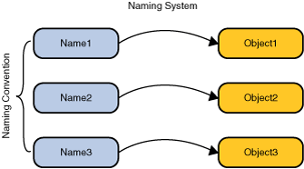

# Naming and Directory Concepts

- [Naming Concepts](#Naming-Concepts)
- [Names](#Names)
- [Bindings](#Bindings)
- [References and Addresses](#References-and-Addresses)
- [Context](#Context)
- [Naming Systems and Namespaces](#Naming-Systems-and-Namespaces)
- [Directory Concepts](#Directory-Concepts)
- [Attributes](#Attributes)
- [Directories and Directory Services](#Directories-and-Directory-Services)
- [Search Service](#Search-Service)
- [Combining Naming and Directory Services](#Combing-Naming-and-Directory-Services)

## Naming Concepts

A fundamental facility in any computing system is the *naming service* -- the means by which names are associated with objects and objects are found based on their names. When using almost any computer program or system, you are always naming one object or another. For example, when you use an electronic mail system, you must provide the name of the recipient. to access a file in the computer, you must supply its name. A naming service allows you to look up an object given its name.



A naming service's primary function is to map people friendly names to objects, such as addresses, identifiers, or objects typically used ty computer programs.

For example, the [Internet Domain Name System (DNS)](https://www.ietf.org/rfc/rfc1034.txt) maps machine names to IP Addresses:

```
www.example.com ==> 192.0.2.5
```

A file system maps a filename to a file reference that a program can use to access the contents of the file.

```
c:\bin\autoexec.bat ==> File Reference
```

These two examples also illustrate the wide range of scale at which naming services exist -- from naming an object on the Internet to naming a file on the local file system.

## Names

To look up an object in a naming system, you supply it the *name* of the object. The naming system determines the syntax that the name must follow. This syntax is sometimes called the naming systems *naming convention*. A name is made up components. A name's representation consist of a component separator marking the components of the name.

Naming System    | Component Separator | Names
---------------- | ------------------- | ---------------------------
UNIX file system | "/"                 | /usr/hello
DNS              | "."                 | sales.Wiz.COM
LDAP             | "," and "="         | cn=Rosanna Lee, o=Sun, c=US

The UNIX file system's naming convention is that a file is named from its path relative to the root of the file system, with each component in the separated from left to right using the forward slash character ("/"). The UNIX pathname, `usr/hello`, for example, names a file `hello` in the file directory `usr`, which is located in the root of the file system.

DNS naming convention calls for components in the DNS name to be ordered from right to left and delimited by the dot character ("."). Thus the DNS name `sales.Wiz.COM` names a DNS entry with the name `sales`, relative to the DNS entry `Wiz.COM`. The DNS entry `Wiz.COM`, in turn, names an entry with the name `Wiz` in the `COM` entry.

The [Lightweight Directory Access Protocol (LDAP)](https://www.ietf.org/rfc/rfc2251.txt) naming convention orders components from right to left, delimited by the comma character (","). Thus the LDAP name `cn=Rosanna Lee, o=Sun, c=US` names an LDAP entry `cn=Rosanna Lee`, relative to the entry `o=Sun`, which in turn, is relative to `c=us`. LDAP has the further rule that each component of the name must be a name/value pair with the name and value separated by an equals character ("=").

## Bindings

The association of a name with an object is called a `binding`. A file name is `bound` to a file.

The DNS contains bindings that map machine names to IP addresses. An LDAP name is bound to an LDAP entry

## References and Addresses

Depending on the naming service, some objects cannot be stored directly by the naming service; that is, a copy of the object cannot be placed inside the naming service. Instead, they must be stored by reference; that is, a `pointer` or `reference` to the object is placed inside the naming service. A reference represents information about how to access an object. Typically, it it a compact representation that can be used to communicate with the object, while the object itself might contain more state information. Using the reference, you can contact the object and obtain more information about the object.

For example, an airplane object might contain a list of the airplane's passengers and crew, its flight plan, and fuel and instrument status, and its flight number and departure time. By contrast, an airplane object reference might contain only its flight number and departure time. The reference is a much more compact representation of information about the airplane object and can be used to obtain additional information. A file object, for example, is accessed using a `file reference`. A printer object, for example, might contain the state of the printer, such as its current queue and the amount of paper in the paper tray. A printer object reference, on the other hand, might contain only information on how to reach the printer, such as its print server name and printing protocol.

Although in general a reference can contain any arbitrary information, it is useful to refer to its contents as `addresses` (or communication end points): specific information about how to access the object.

For simplicity, this tutorial uses "Object" to refer to both objects and object references when a distinction between the two is not required.

## Context

A `context` is a set of name-to-object bindings. Every context has an associated naming convention. A context always provides a lookup (*resolution*) operation that returns the object, it typically also provides operations such as those for binding names, unbinding names and listing bound names. A name in one context object can be bound to another context object (called a *subcontext*) that has the same naming convention.


A file directory, such as `/usr`, in the UNIX file system represents a context. A file directory named relative to another file directory represents a subcontext (UNIX user refer to this as a *subdirectory*). That is, in a file directory `/usr/bin`, the directory `bin` is a subcontext of `usr`. A DNS domain, such as COM, represents a subcontext. For the DNS  domain Sum.COM, the DNS domain `Sun` is a subcontext of `COM`.

Finally, an LDAP entry, such as `c=us`, represents a context, An LDAP entry named relative to another LDAP entry represents a subcontext. For the LDAP entry `o=sum,c=us`, the entry `o=sun` is a subcontext of `c=us`.

## Naming Systems and Namespaces

A *naming system* is a connected set of contexts of the same type (they have the same naming convention) and provides a common set of operations.

A system that implements the DNS is a naming system. A system that communicates using the LDAP is a naming system.

A naming system provides a *naming service* to its customers for performing naming-related operations. A naming service is accessed through its own interface. The DNS offers a naming service that maps machine names to IP addresses. LDAP offers a naming service that maps LDAP names to LDAP entries. A file system offers a naming service that maps filenames to files and directories.

A *namespace* is the set of all possible names in a naming system. The UNIX file system has a namespace consisting of all of the names of files and directories in that file system. The DNS namespace contains names of DNS domains and entries. The LDAP namespace contains names of LDAP entries.

## Directory Concepts

Many naming services are extended with a *directory service*. A directory service associates names with objects and also associates such objects with `attributes`.

directory service = naming service + objects containing attributes

You not only can look up an object by its name but also get the object's attributes or `search` for the object based on its attributes.


An example is the telephone company's directory service. It maps a subscriber's name to his address and phone number. A computer's directory service is very much like a telephone company's directory service in that both can be used to store information such as telephone numbers and addresses. The computer's directory service is much more powerful, however, because it is available online and can be used to store a variety of information that can be utilized by users, programs, and even the computer itself and other computers.

A *directory object* represents and object in a computing environment. A directory object can be used, for example, to represent a printer, a computer, or a network. A directory object contains *attributes* that describe the object that it represents.

## Attributes

A directory object can have *attributes*. For example, a printer might be represented by a directory object that has as attributes its speed, resolution, and color. A user might be represented by a directory object that has as attributes the user's e-mail address, various telephone numbers, postal mail address, and computer account information.

An attribute has an *attribute identifier* and a set of *attribute values*. An attribute identifier is a token that identifies an attribute independent of its values. For example, two different computer account might have a "`mail`" attribute; "`mail`" is the attribute identifier. An attribute value is the contents of the attribute. The email address , for example, might have:

`Attribute Identifier` | `Attribute Value`
---------------------: | ------------------------
`mail`                 | `john.smith@example.com`

## Directories and Directory Services

A *directory* is a connected set of directory objects. A *directory service* is a service that provides operations for creating, adding, removing, and modifying the attributes associated with objects in a directory. The service is accessed through its own interface.

Many examples of directory services are possible.

Network Information Service (NIS)

    NIS is a directory service available on the UNIX operating system for storing system-related information, such as that relating to machines, networks, printers, and users.

[Oracle Directory Server](https://www.oracle.com/technetwork/testcontent/index-085178.html)

    The Oracle Directory Server is a general-purpose directory service based on the Internet standard LDAP.

## Search Service

You can look up a directory object by supplying its name to the directory service. Alternatively, many directories, such as those based on the LDAP, support the notion of *searches*. When you search, you can supply not a name but a *query* consisting of a logical expression in which you specify the attributes that the object or objects must have. The query is called a *search filter*. This style of searching is sometimes called *reverse lookup* or *content-based searching *. The directory service searches for and returns the objects that satisfy the search filter.

For example, you can query the directory service to find:

- all users that have the attribute "`age`" greater than 40 years.
- all machines whose IP address starts with "192.113.50".

## Combining Naming and Directory Services

Directories often arrange their objects in a hierarchy. For example, the LDAP arranges all directory objects in a tree, call *directory information tree (DIT)*. Within the DIT, an organization object, for example, might contain group objects that might in turn contain person objects. When directory objects are arranged in this way, they play the role of naming contexts in addition to that of containers of attributes.
