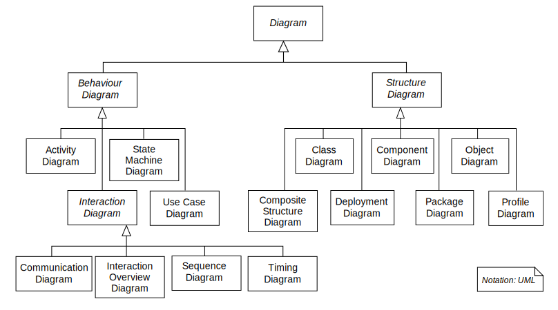
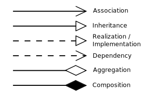

# Unified Modeling Language

## Diagrams

---

* Structural UML diagrams
  * [Class diagram](#class-diagram)
    * [Members](#members)
      * [Visibility](#visibility)
      * [Scope](#scope)
    * [Relationships](#relationships)
      * [Instance-level relationships](#instance-level-relationships)
      * [Class-level relationships](#class-level-relationships)
      * [General relationship](#general-relationship)
    * [Multiplicity](#multiplicity)

---

## Class diagram

In the diagram, classes are represented with boxes that contain three compartments:

* The top compartment contains the name of the class. It is printed in bold and centered, and the first letter is capitalized.
* The middle compartment contains the attributes of the attributes of the class. They are left-aligned and the first letter is lowercase.
* The bottom compartment contains the operations the class can execute. They are also left-aligned and  the first letter is lowercase.

### Members

UML provides mechanisms to represent class members, such as attributes and methods, and additional information about them.

#### Visibility

To specify the visibility of a class member (i.e. any attribute or method), these notations must be placed placed before the member's name:

* `+` Public
* `-` Private
* `#` Protected
* `/` Derived (can be combined with one of the others)
* `~` Package
* `*` Random

#### Scope

The UML specifies two types of scope for members: *instance* and *classifier*, and the latter is represented by <u>underlined names</u>.

* **Classifier members** are commonly recognized as "static" in may programming languages. The scope is the class itself.
  * Attribute values are equal for all instances
  * Method invocation does not affect the instance's state
* **Instance members** are scoped to a specific instance.
  * Attribute values may vary between instances
  * Method invocation may affect the instance's state (i.e. change instance's attributes)

To indicate a classifier scope for a member, its name must be underlined. Otherwise, instance scope is assumed by default.

### Relationships

A relationship is a general term covering the specific types of logical connections found on class and object diagrams. UML defines the following relationships:

#### Instance-level relationships

* **Dependency**（依赖）

  A *dependency* is a semantic connection between dependent and independent model elements. It exists between two elements if changes to te definition of one element (the sever or target) may cause changes to the other (the client or source). This association is uni-directional.

* **Association**（关联）

  An *association* represents a family of links. A binary association (with two ends) is normally represented as a line. An association can link any number of classes. An association with three links is called a ternary association. An association can be named, and the ends of an association can be adorned with role names, ownership indicators, multiplicity, visibility, and other properties.

  

  There are for different types of association: bi-directional, uni-directional, aggregation (includes composition aggregation) and reflexive. Bi-directional and uni-directional associations are the most common ones.

  For instance, a flight class is associated with a plane class bi-directionally. Association represents the static relationship shared among the objects of two classes.

* **Aggregation**（聚合）

  *Aggregation* is a variant of the "has a" association relationship; aggregation is more specific than association. It is an association that represents a part-whole or part-of relationship. As shown in the image, a Professor 'has a' class to teach. As a type of association, an aggregation can be named and have the same adornments that an association can. However, an aggregation may not involve more than two classes; it must be a binary association.
  Furthermore, there is hardly a difference between aggregations and associations during implementation, and the diagram may skip aggregation relations altogether.

  

  *Aggregation* can occur when a class is a collection or container of other classes, but the contained classes do not have a strong *lifecycle dependency* on the container. The contents of the container still exist when the container is destroyed.

  In UML, it is graphically represented as a *hollow* diamond shape on the containing class with a single line that connects it to the contained class. The aggregate is semantically an extended object that is treated as a unit in many operations, although physically it is made of several lesser objects.

  Example: Library and Students. Here the student can exist without library, the relation between student and library is aggregation.

* **Composition**（组成）

  The UML representation of a composition relationship shows composition as *filled* diamond shape on the containing class end of the lines that connect contained class(es) to the containing class.

* **Differences between Composition and Aggregation**

  * **Composition relationship**
    1. When attempting to represent real-world whole-part relationships, e.g. an engine is a part of a car.
    2. when the container is destroyed, the contents are also destroyed, e.g. a university and its departments.
  * **Aggregation relationship**
    1. When representing a software or database relationship, e.g. car model engine ENG01 is part of a car model CM01, as the engine, ENG01, may be also part of a different car model.
    2. When the container is destroyed, the contents are usually not destroyed, e.g. a professor has students, when the professor dies the students don't die along with him or her.

    

  Thus the aggregation relationship is often "catalog" containment to distinguish it from composition's "physical" containment.

#### Class-level relationships

* **Generalization/Inheritance**（继承）

  It indicates that one of the two related classes (the *subclass*) is considered to be a specialized from of the other (the *super type*) and the superclass is considered a Generalization of the subclass. In practice, means that any instance of the subtype is also an instance of the superclass. An exemplary tree of generalizations of this form is found in biological classification: humans are a subclass of simian, which is a subclass of mammal, and so on. The relationship is most easily understood by the phrase 'an A is a B' (a human is a mammal, a mammal is an animal)

  The UML graphical representation of a Generalization is a hollow triangle shape on the superclass end of the line (or tree of lines) that connects it to one or more subtypes.

  

  The generalization relationship is also known as the *inheritance* or *"is a"* relationship.

  The *superclass*(base class) in the generalization relationship is also known as the *"parent"*, *superclass*, *base class*, or *base type*.

  The *subtype* in the specialization relationship is also known as the *"child"*, *subclass*, *derived class*, *derived type*, *inheriting class*, or *inheriting type*.

  Note that this relationship bears no resemblance to the the biological parent-child relationship: the use of these terms is extremely common, but can be misleading.

  > A is a type of B
  >
  > For example, "an oak is a type of tree", "an automobile is a type of vehicle"

  Generalization can only be shown on class diagrams and on use case diagrams.

* **Realization/Implementation**（实现）

  In UML modelling, a realization relationship is a relationship between two model elements, in which one model element (the client) realizes (implements or executes) the behavior that the other model element (supplier) specifies.

  The UML graphical representation of a Realization is a hollow triangle shape on the interface end of the *dashed* line (or tree of lines) that connects it to one or more implementors. A plain arrow head is used on the interface end of the dashed line that connects it to its users. In component diagrams, the ball-and-socket graphic convention is used (implementor expose a ball or lollipop, where as users show a socket). Realizations can only be shown on class or component diagrams. A realization is a relationship between classes, interfaces, components and packages that connects a client element with a supplier element. A realization relationship between classes/components and interfaces shows that the class/component realizes the operations offered by the interface.

#### General relationship

* **Dependency**（依赖）

  Dependency is a weaker form of bond that indicates that one class depends on another because it uses it at some point in time. One class depends on another if the independent class is a parameter variable or local variable of a method of the dependent class. This is different from an association, where an attribute of the dependent class is an instance of the independent class. Sometimes the relationship between two classes is very weak. They are not implemented with member variable at all. Rather they might be implemented as member function arguments.

### Multiplicity

This association relationship indicates that (at least) one of the two related classes make reference to the other. This relationship is usually described as "A has a B" (a mother cat has kittens, kittens have a mother cat).

The UML representation of an association is a line connecting the two associated classes. At each end of the line there is optional notation. For example, we can indicate, using an arrowhead that the pointy end is visible from the arrow tail. We can indicate ownership by the placement of a ball, the role the elements of that end play by supplying a name for the role, and the *multiplicity* of instances of that entity (the range of number of objects that participate in the association from the perspective of the other end).

Range|Meaning
---:|:---
0|No instances (rare)
0..1|No instances, or one instance
1|Exactly one instance
1..1|Exactly one instance
0..*|Zero or more instances
*|Zero or more instances
1..*|One or more instances